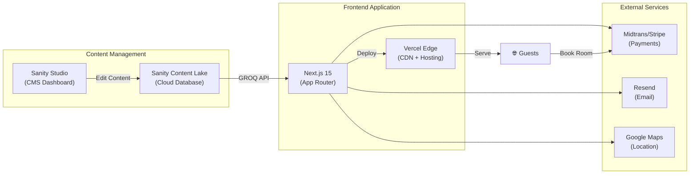

# 🏨 Website Hotel Bintang 5 — Implementation Plan

## Ringkasan Proyek

Membangun website hotel bintang 5 modern yang menggantikan website WordPress lama, dengan CMS headless untuk kemudahan update konten oleh tim non-teknis. Website harus setara dengan standar industri hotel mewah global (One&Only, Atlantis The Royal, Ritz Paris).

---

## User Review Required

> [!IMPORTANT]
> **Nama Hotel**: Mohon beritahu nama hotel agar bisa diterapkan ke seluruh branding, meta tags, dan domain.

> [!IMPORTANT]
> **Konten Existing**: Apakah ada konten (foto, teks, logo) dari website WordPress lama yang ingin dimigrasikan?

> [!IMPORTANT]
> **Hosting Preference**: Apakah ada preferensi hosting? Rekomendasi kami adalah **Vercel** (untuk frontend) + **Sanity Cloud** (untuk CMS). Keduanya memiliki free tier yang cukup untuk memulai.

---

## Tech Stack yang Direkomendasikan

| Layer | Teknologi | Alasan |
|:---|:---|:---|
| **Frontend** | **Next.js 15** (App Router, TypeScript) | SSR/SSG terbaik, SEO excellent, performa tinggi |
| **CMS** | **Sanity.io** (Headless CMS) | Real-time editing, visual preview, structured content, image CDN built-in |
| **Styling** | **CSS Modules + CSS Variables** | Kontrol penuh, tidak ada dependency tambahan, performa terbaik |
| **Hosting** | **Vercel** | Deploy otomatis, edge caching, preview environments |
| **Internationalization** | **next-intl** | Bilingual ID/EN dengan routing otomatis |
| **Payments** | **Midtrans / Stripe** | Payment gateway untuk booking engine |
| **Auth** | **Auth.js (NextAuth)** | Untuk area member/guest login |
| **Email** | **Resend / Nodemailer** | Konfirmasi booking, inquiry response |
| **Analytics** | **Google Analytics 4 + Vercel Analytics** | Tracking konversi dan performa |
| **Maps** | **Google Maps Embed API** | Lokasi hotel interaktif |

### Mengapa Sanity.io (bukan WordPress)?

| Aspek | WordPress | Sanity.io |
|:---|:---|:---|
| **Kecepatan** | Lambat tanpa optimisasi ekstensif | Data via API = ultra-cepat |
| **Keamanan** | Target utama hacker, perlu update rutin | Tidak ada server publik, zero attack surface |
| **Editorial UX** | Dashbard kuno, plugin conflicts | Studio modern, real-time preview, kolaborasi tim |
| **Gambar** | Perlu plugin optimisasi | Built-in image CDN dengan crop/resize otomatis |
| **Skalabilitas** | Database bottleneck | Content Lake global, auto-scaling |
| **Maintenance** | Update core, plugin, tema konstan | Zero maintenance, managed service |

---

## Arsitektur Sistem



---

## Struktur Halaman & Konten

### Sitemap

```
/                           → Homepage
/rooms                      → All Rooms & Suites
/rooms/[slug]               → Room Detail
/dining                     → Dining Overview
/dining/[slug]              → Restaurant/Bar Detail
/spa                        → Spa & Wellness
/events                     → Events & Weddings
/gallery                    → Photo & Video Gallery
/offers                     → Promo & Special Offers
/offers/[slug]              → Offer Detail
/blog                       → Blog / News
/blog/[slug]                → Blog Post Detail
/virtual-tour               → 360° Virtual Tour
/about                      → About the Hotel
/contact                    → Contact & Location
/booking                    → Booking Engine
/booking/confirmation       → Booking Confirmation
```

Setiap halaman tersedia dalam 2 bahasa:
- `/id/rooms` → Bahasa Indonesia
- `/en/rooms` → English

---

### Sanity CMS Content Schemas

Tim hotel dapat mengelola semua konten berikut melalui dashboard CMS yang user-friendly:

#### Core Content Types

| Schema | Fields | Keterangan |
|:---|:---|:---|
| **Room** | name, slug, category, description, images[], amenities[], price, maxGuests, bedType, size, view, isAvailable | Tipe kamar dengan detail lengkap |
| **Restaurant** | name, slug, cuisine, description, images[], menu (PDF), openingHours, reservationLink | Restoran & Bar |
| **SpaService** | name, slug, description, duration, price, images[], category | Treatment spa |
| **Event** | name, slug, description, images[], capacity, features[], inquiryForm | Ruang meeting & wedding |
| **Offer** | title, slug, description, images[], validFrom, validTo, discountType, rooms[] | Promo & paket spesial |
| **BlogPost** | title, slug, author, publishDate, body (rich text), coverImage, category, tags[] | Artikel blog |
| **Testimonial** | guestName, rating, comment, roomRef, date, avatar | Review tamu |
| **Gallery** | title, images[], category (rooms/dining/spa/events/exterior) | Galeri foto |

#### Site-Wide Settings (editable via CMS)

| Schema | Fields |
|:---|:---|
| **SiteSettings** | hotelName, logo, tagline, address, phone, email, socialLinks[], bookingCTA |
| **Homepage** | heroVideo, heroTitle, heroSubtitle, featuredRooms[], featuredOffers[], highlights[] |
| **Navigation** | menuItems[], footerLinks[], ctaButton |
| **SEODefaults** | defaultTitle, defaultDescription, ogImage, googleVerification |

---

## Desain & UX — Standar Hotel Bintang 5

### Design Philosophy: "Quiet Luxury"

Mengikuti tren industri hotel mewah 2025-2026:

1. **Hero Visual yang Immersive** — Full-screen video/foto HD sebagai first impression
2. **Tipografi Elegan** — Font serif premium (Playfair Display) + sans-serif modern (Inter)
3. **Color Palette Mewah** — Gold accent pada dark/neutral background
4. **White Space Generous** — Layout yang "bernafas", tidak padat
5. **Micro-animations** — Subtle scroll reveals, parallax, hover effects
6. **Booking CTA Persistent** — Tombol "Book Now" selalu terlihat

### Color System

```
Primary:       #1A1A1A (Rich Black)
Secondary:     #F5F0E8 (Warm Cream)
Accent:        #C5A55A (Luxury Gold)
Accent Hover:  #D4B96A (Bright Gold)
Text Primary:  #2D2D2D (Charcoal)
Text Light:    #8A8A8A (Muted Gray)
White:         #FFFFFF
Success:       #2E7D32 (Deep Green)
Error:         #C62828 (Deep Red)
```

### Typography

```
Headings:  "Playfair Display", serif (weight: 400, 700)
Body:      "Inter", sans-serif (weight: 300, 400, 500, 600)
Accent:    "Cormorant Garamond", serif (for quotes, taglines)
```

---

## Fitur Detail

### 1. 🏠 Homepage
- Full-screen hero video dengan overlay text + CTA "Book Now"
- Inline booking bar (check-in, check-out, guests, room type)
- Featured Rooms carousel (3-4 kamar unggulan)
- Hotel highlights (awards, USPs) dengan icon animations
- Dining teaser section
- Spa teaser section
- Current offers slider
- Guest testimonials carousel
- Instagram feed embed
- Newsletter signup

### 2. 🛏️ Rooms & Suites
- Grid/list view toggle
- Filter by category, price, capacity
- Setiap kamar: fullscreen image gallery, amenities list, 360° view (jika ada), pricing, "Book This Room" CTA
- Room comparison feature (opsional)

### 3. 🍽️ Dining
- Showcase setiap restoran/bar
- Menu download (PDF)
- Operating hours
- Reservation CTA (link atau form)
- Chef spotlight

### 4. 💆 Spa & Wellness
- Treatment categories dengan pricing
- Spa facilities showcase
- Booking/inquiry form
- Relaxation ambiance (video background)

### 5. 🎉 Events & Weddings
- Venue showcase dengan spesifikasi (kapasitas, fasilitas)
- Wedding packages
- Corporate meeting packages
- Inquiry/RFP form
- Past events gallery

### 6. 📸 Gallery
- Masonry/grid layout
- Filter by category
- Lightbox dengan swipe navigation
- Lazy loading untuk performa

### 7. 📰 Blog & News
- Category filtering
- Search functionality
- Related posts
- Social sharing
- Rich text content (images, videos, embeds)

### 8. 🎁 Promo & Offers
- Active offers dengan countdown timer
- Promo detail dengan terms & conditions
- Direct booking CTA per offer

### 9. 🌐 Virtual Tour
- 360° panoramic view integration
- Multi-room navigation
- Hotspot points of interest

### 10. ⭐ Guest Reviews
- Rating display (stars)
- Featured testimonials
- Review aggregation (rata-rata rating)

### 11. 📅 Booking Engine (Custom Built)
- Step-by-step booking flow:
  1. Select dates & guests
  2. Choose room
  3. Add extras (breakfast, spa, etc.)
  4. Guest details
  5. Payment (Midtrans/Stripe)
  6. Confirmation + email
- Admin dashboard di Sanity untuk melihat bookings
- Calendar availability view

### 12. 🌍 Bilingual (ID/EN)
- Language switcher di header
- URL-based routing (`/id/...` & `/en/...`)
- Semua konten CMS mendukung 2 bahasa
- SEO meta tags per bahasa

---

## Proposed Changes

### Phase 1: Foundation Setup

#### [NEW] `package.json`
Inisialisasi Next.js 15 project dengan TypeScript, beserta dependencies:
- `next`, `react`, `react-dom`
- `next-sanity`, `@sanity/image-url`, `@sanity/vision`
- `next-intl` (i18n)
- `framer-motion` (animasi)
- `lucide-react` (icons)

#### [NEW] `sanity/` directory
Sanity Studio sebagai embedded studio di Next.js:
- `sanity.config.ts` — Konfigurasi studio
- `sanity/schemas/` — Semua content schemas (room, restaurant, spa, etc.)
- `sanity/lib/client.ts` — Sanity client config
- `sanity/lib/queries.ts` — GROQ queries

#### [NEW] `src/app/` directory (App Router)
```
src/app/
├── [locale]/
│   ├── layout.tsx          — Root layout dengan i18n
│   ├── page.tsx            — Homepage
│   ├── rooms/
│   │   ├── page.tsx        — Rooms listing
│   │   └── [slug]/page.tsx — Room detail
│   ├── dining/
│   ├── spa/
│   ├── events/
│   ├── gallery/
│   ├── blog/
│   ├── offers/
│   ├── virtual-tour/
│   ├── about/
│   ├── contact/
│   └── booking/
├── api/
│   ├── booking/route.ts    — Booking API
│   └── contact/route.ts    — Contact form API
└── studio/[[...index]]/
    └── page.tsx            — Embedded Sanity Studio (/studio)
```

#### [NEW] `src/components/` directory
Reusable UI components:
- `Header` — Navigation + language switcher + Book Now CTA
- `Footer` — Links, contact info, newsletter
- `HeroVideo` — Full-screen hero dengan video
- `BookingBar` — Inline date picker booking widget
- `RoomCard` — Room preview card
- `Gallery` — Lightbox image gallery
- `TestimonialCarousel` — Guest reviews slider
- `AnimatedSection` — Scroll-triggered animations

#### [NEW] `src/styles/` directory
- `globals.css` — CSS variables, reset, typography
- `components/` — CSS Modules per component

#### [NEW] `messages/` directory
- `id.json` — Terjemahan Bahasa Indonesia
- `en.json` — English translations

---

### Phase 2: Core Pages (Homepage, Rooms, Dining)

Implementasi 3 halaman utama dengan konten dari Sanity CMS.

### Phase 3: Secondary Pages (Spa, Events, Gallery, Blog, Offers)

Implementasi halaman pendukung.

### Phase 4: Booking Engine

Custom booking flow dengan payment integration.

### Phase 5: Polish & Launch

- Performance optimization (Core Web Vitals)
- SEO audit
- Accessibility audit (WCAG 2.1 AA)
- Content migration dari WordPress
- Domain setup & go-live

---

## Verification Plan

### Automated Tests
```bash
# Type checking
npx tsc --noEmit

# Linting
npx next lint

# Build verification
npm run build

# Lighthouse CI (performance, SEO, accessibility)
npx lighthouse http://localhost:3000 --output=json
```

### Manual Verification
- Preview di desktop & mobile
- Test booking flow end-to-end
- Verify CMS editing → website update flow
- Cross-browser testing (Chrome, Safari, Firefox, Edge)
- Test language switching (ID ↔ EN)

---

## Timeline Estimasi

| Phase | Durasi | Deliverable |
|:---|:---|:---|
| Phase 1: Setup | 1-2 hari | Project skeleton, CMS schemas, design system |
| Phase 2: Core Pages | 3-5 hari | Homepage, Rooms, Dining |
| Phase 3: Secondary | 3-4 hari | Spa, Events, Gallery, Blog, Offers |
| Phase 4: Booking | 3-5 hari | Full booking engine + payments |
| Phase 5: Polish | 2-3 hari | Performance, SEO, accessibility, launch |

**Total estimasi: 12-19 hari kerja**

---

> [!TIP]
> Saya merekomendasikan memulai dengan **Phase 1 + 2** terlebih dahulu agar Anda bisa melihat fondasi dan desain website sebelum melanjutkan ke fitur lainnya.
