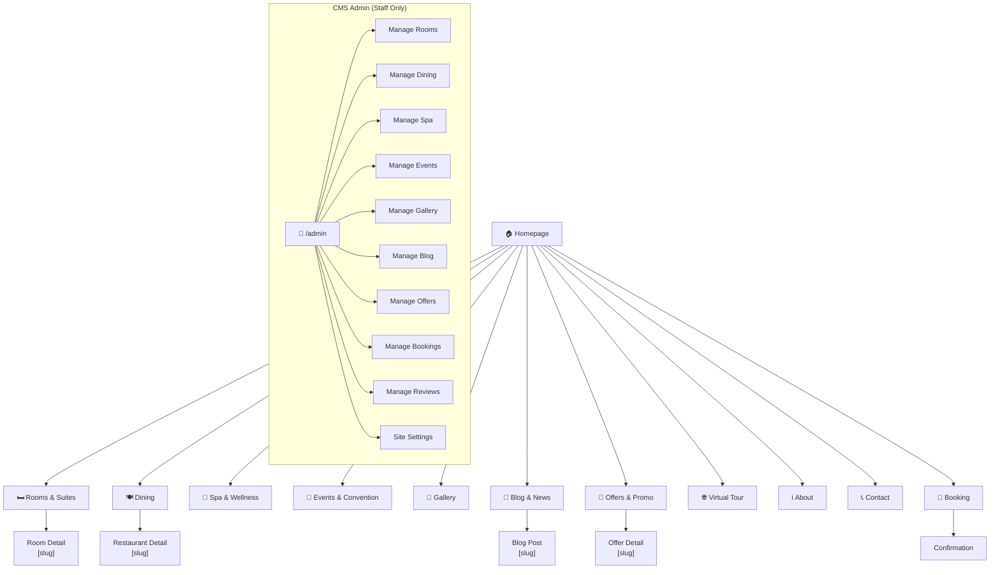
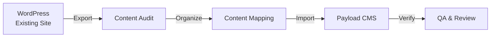
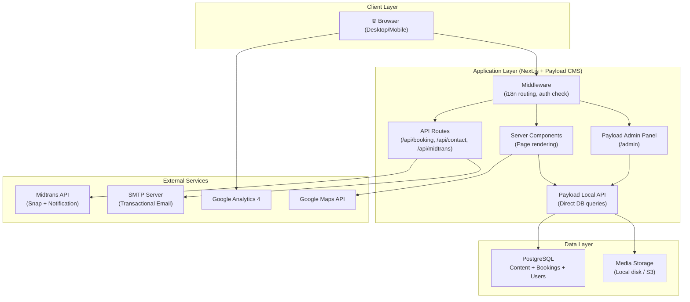
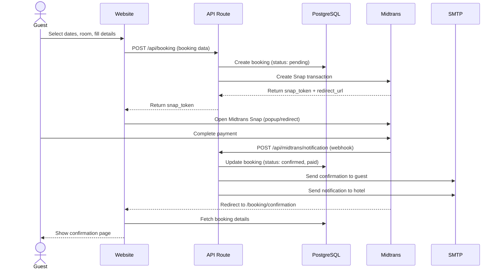
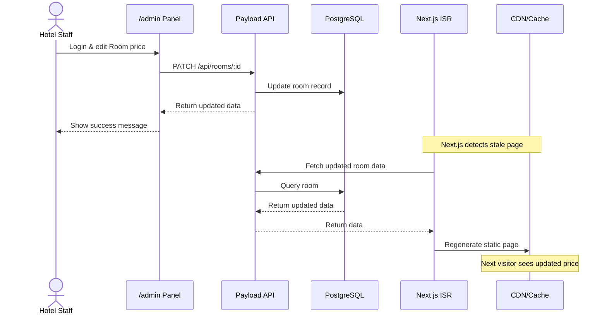
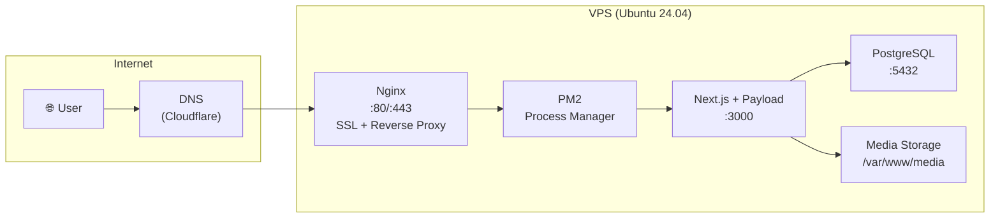
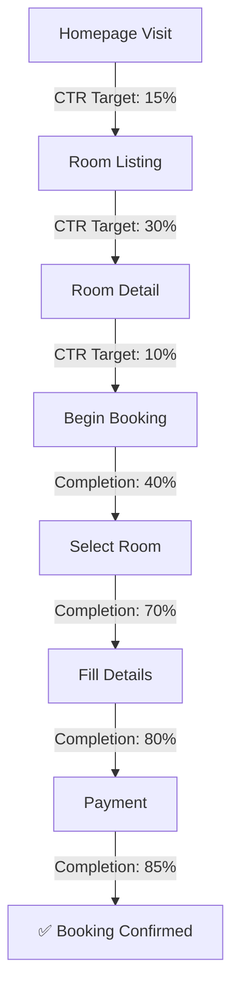
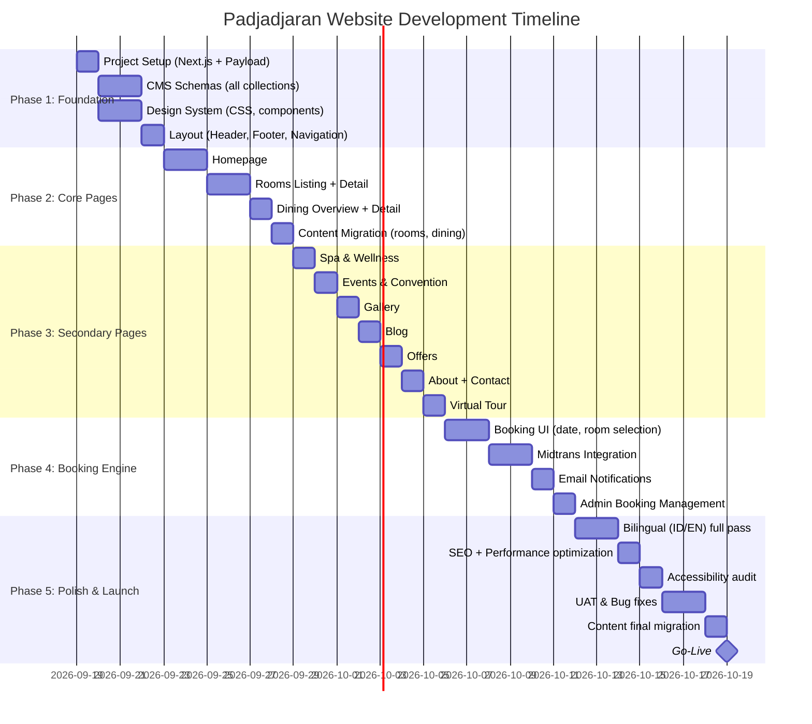

# 📋 Product Requirements Document (PRD)
## Padjadjaran Suites Resort & Convention — Website Redesign

| Field | Detail |
|:---|:---|
| **Produk** | Website Padjadjaran Suites Resort & Convention |
| **Versi** | 1.0 |
| **Tanggal** | 18 September 2026 |
| **Status** | Draft — Menunggu Approval |
| **Stakeholder** | Management Padjadjaran Suites Resort & Convention |
| **Platform Lama** | WordPress (padjadjaransuitesresort.com) |
| **Platform Baru** | Next.js 15 + Payload CMS v3 + PostgreSQL |

---

## Daftar Isi

1. [Executive Summary](#1-executive-summary)
2. [Business Objectives & KPIs](#2-business-objectives--kpis)
3. [User Personas](#3-user-personas)
4. [Information Architecture](#4-information-architecture)
5. [Functional Requirements](#5-functional-requirements)
6. [User Stories & Acceptance Criteria](#6-user-stories--acceptance-criteria)
7. [Non-Functional Requirements](#7-non-functional-requirements)
8. [Content Migration Strategy](#8-content-migration-strategy)
9. [CMS Content Schema](#9-cms-content-schema)
10. [Design System](#10-design-system)
11. [Technical Architecture](#11-technical-architecture)
12. [API Specifications](#12-api-specifications)
13. [Analytics & Tracking](#13-analytics--tracking)
14. [Risk Assessment](#14-risk-assessment)
15. [Timeline & Rollout Plan](#15-timeline--rollout-plan)

---

## 1. Executive Summary

### 1.1 Latar Belakang

Padjadjaran Suites Resort & Convention adalah hotel bintang 4-5 yang berlokasi di Bogor Nirwana Residence, Bogor, Jawa Barat. Hotel ini menawarkan 118+ kamar, 3 outlet F&B, spa & wellness center, kolam renang outdoor, dan Bale Pakuan Ballroom berkapasitas hingga 1.000 orang dengan 20-22 function rooms.

Website saat ini menggunakan **WordPress** yang mengalami beberapa keterbatasan:
- Performa loading lambat
- Desain tidak mencerminkan standar hotel premium
- Sulit di-update oleh tim non-teknis (plugin conflicts, update konstan)
- Keamanan rentan (target utama hacker)
- Tidak memiliki booking engine terintegrasi
- SEO tidak optimal

### 1.2 Visi Produk

> Membangun website hotel digital terbaik yang menyampaikan pengalaman "Quiet Luxury" Padjadjaran Suites secara online, memudahkan tamu untuk menemukan informasi dan melakukan reservasi langsung, serta memberikan kemudahan total bagi tim hotel untuk mengelola konten tanpa bantuan developer.

### 1.3 Scope

| In Scope | Out of Scope |
|:---|:---|
| Website publik (12+ halaman) | Mobile app (native iOS/Android) |
| CMS admin panel | Property Management System (PMS) |
| Booking engine + Midtrans payment | Channel Manager integration |
| Bilingual (ID/EN) | Bahasa lain selain ID/EN |
| Content migration dari WordPress | Social media management |
| SEO optimization | Paid ads / SEM campaign |
| Email notifikasi booking | Marketing automation |
| Analytics setup | Business intelligence dashboard |

---

## 2. Business Objectives & KPIs

### 2.1 Primary Objectives

| # | Objective | Deskripsi |
|:---|:---|:---|
| **O1** | Meningkatkan Direct Booking | Mengurangi dependency pada OTA (Traveloka, Agoda, dll) dengan menyediakan booking langsung via website |
| **O2** | Meningkatkan Brand Image | Menampilkan citra hotel bintang 5 yang premium dan modern secara digital |
| **O3** | Kemudahan Content Management | Tim hotel dapat update konten (promo, foto, blog, harga) tanpa developer |
| **O4** | SEO & Discoverability | Meningkatkan visibilitas di Google untuk keyword "hotel Bogor", "resort Bogor", "convention Bogor" |
| **O5** | Meningkatkan Event Inquiry | Mendorong lebih banyak inquiry untuk wedding, meeting, dan convention |

### 2.2 Key Performance Indicators (KPIs)

| KPI | Baseline (WordPress) | Target (6 bulan) | Target (12 bulan) |
|:---|:---|:---|:---|
| **Page Load Time** | > 5 detik | < 3 detik | < 2 detik |
| **Bounce Rate** | ~60% | < 40% | < 35% |
| **Direct Booking / bulan** | ~0 (belum ada) | 20 booking | 50 booking |
| **Organic Traffic** | - | +30% | +60% |
| **Event Inquiry / bulan** | - | 15 inquiry | 30 inquiry |
| **Mobile Responsiveness Score** | ~50/100 | > 90/100 | > 95/100 |
| **Lighthouse Performance** | ~40 | > 85 | > 90 |
| **CMS Content Update Frequency** | Jarang (perlu developer) | 3x / minggu | Daily |

---

## 3. User Personas

### 3.1 Persona 1: Tamu Leisure (Keluarga)

| Attribute | Detail |
|:---|:---|
| **Nama** | Budi & Keluarga |
| **Usia** | 35-50 tahun |
| **Lokasi** | Jakarta, Bandung, sekitarnya |
| **Motivasi** | Staycation akhir pekan, liburan keluarga ke Bogor |
| **Behavior** | Browse di mobile, bandingkan harga dengan OTA, ingin lihat foto & fasilitas anak |
| **Pain Points** | Tidak bisa melihat kamar secara detail, harga tidak transparan, proses booking ribet |
| **Goals** | Menemukan kamar yang cocok untuk keluarga, booking cepat, mendapat harga terbaik |

### 3.2 Persona 2: Tamu Bisnis / Corporate

| Attribute | Detail |
|:---|:---|
| **Nama** | Ibu Ratna — Corporate Secretary |
| **Usia** | 30-45 tahun |
| **Lokasi** | Jakarta |
| **Motivasi** | Mencari venue meeting / gathering perusahaan di luar Jakarta |
| **Behavior** | Riset di desktop, butuh info kapasitas ruang, harga paket, dan contact person cepat |
| **Pain Points** | Info meeting room tidak lengkap, tidak ada floorplan, proses inquiry lambat |
| **Goals** | Mendapat proposal meeting/event dengan cepat, bisa melihat semua venue options |

### 3.3 Persona 3: Calon Pengantin

| Attribute | Detail |
|:---|:---|
| **Nama** | Anisa & Reza |
| **Usia** | 25-35 tahun |
| **Lokasi** | Bogor, Jakarta |
| **Motivasi** | Mencari venue pernikahan yang elegan dengan pemandangan alam |
| **Behavior** | Browse gallery wedding, lihat testimoni, bandingkan paket wedding |
| **Pain Points** | Foto wedding venue terbatas, harga paket tidak jelas, tidak ada virtual tour |
| **Goals** | Visualisasi acara di venue, mendapat info paket lengkap, site visit booking |

### 3.4 Persona 4: Tamu Internasional

| Attribute | Detail |
|:---|:---|
| **Nama** | Mr. James Chen |
| **Usia** | 40-55 tahun |
| **Lokasi** | Singapura, Malaysia, Australia |
| **Motivasi** | Business trip atau leisure, mencari resort dekat Jakarta dengan nature vibes |
| **Behavior** | Browse dalam bahasa Inggris, cek review, compare di Google Maps |
| **Pain Points** | Website hanya bahasa Indonesia, tidak bisa booking langsung, kurang info lokasi |
| **Goals** | Menemukan info dalam English, booking online, memahami akses dari Jakarta |

### 3.5 Persona 5: Admin Hotel (Content Manager)

| Attribute | Detail |
|:---|:---|
| **Nama** | Pak Hendra — Marketing Manager |
| **Usia** | 28-40 tahun |
| **Lokasi** | On-site hotel |
| **Motivasi** | Update promo mingguan, upload foto event terbaru, kelola booking masuk |
| **Behavior** | Login ke admin panel, edit konten, upload gambar, review booking |
| **Pain Points** | WordPress susah di-edit, plugin sering error, perlu developer untuk update kecil |
| **Goals** | Update konten sendiri dengan mudah, lihat statistik booking, publish blog tanpa ribet |

---

## 4. Information Architecture

### 4.1 Sitemap



### 4.2 URL Structure

| Halaman | URL (ID) | URL (EN) |
|:---|:---|:---|
| Homepage | `/id` | `/en` |
| Rooms & Suites | `/id/rooms` | `/en/rooms` |
| Room Detail | `/id/rooms/[slug]` | `/en/rooms/[slug]` |
| Dining | `/id/dining` | `/en/dining` |
| Restaurant Detail | `/id/dining/[slug]` | `/en/dining/[slug]` |
| Spa & Wellness | `/id/spa` | `/en/spa` |
| Events & Convention | `/id/events` | `/en/events` |
| Gallery | `/id/gallery` | `/en/gallery` |
| Blog / News | `/id/blog` | `/en/blog` |
| Blog Post | `/id/blog/[slug]` | `/en/blog/[slug]` |
| Offers | `/id/offers` | `/en/offers` |
| Offer Detail | `/id/offers/[slug]` | `/en/offers/[slug]` |
| Virtual Tour | `/id/virtual-tour` | `/en/virtual-tour` |
| About | `/id/about` | `/en/about` |
| Contact | `/id/contact` | `/en/contact` |
| Booking | `/id/booking` | `/en/booking` |
| Booking Confirmation | `/id/booking/confirmation` | `/en/booking/confirmation` |
| CMS Admin | `/admin` | `/admin` |

### 4.3 Navigation Structure

**Primary Navigation (Header):**
```
[Logo]  Rooms  Dining  Spa  Events  Gallery  Offers  [🌐 ID/EN]  [📅 Book Now]
```

**Secondary Navigation (Footer):**
```
Column 1: About | Blog | Contact | Careers
Column 2: Rooms | Dining | Spa | Events
Column 3: Privacy Policy | Terms | Sitemap | FAQ
Column 4: Address | Phone | WhatsApp | Social Media
```

**Mobile Navigation:**
```
[Logo]  [☰ Hamburger]  [📅 Book Now]
→ Slide-in menu with all pages
```

---

## 5. Functional Requirements

### FR-01: Homepage

| ID | Requirement | Priority | Deskripsi |
|:---|:---|:---|:---|
| FR-01.01 | Hero Section | **P0** | Full-screen hero video/image dengan overlay text (tagline hotel) dan CTA "Book Now". Video/image harus bisa diganti via CMS. Autoplay, muted, loop. |
| FR-01.02 | Booking Bar | **P0** | Inline booking widget di bawah hero: date picker (check-in, check-out), jumlah tamu (adults/children), tipe kamar (dropdown). Submit → redirect ke halaman booking dengan parameter. |
| FR-01.03 | Hotel Highlights | **P1** | Section "Why Padjadjaran" — 3-4 USP cards dengan icon (Mountain View, 20+ Meeting Rooms, Spa & Pool, dll). Editable via CMS. |
| FR-01.04 | Featured Rooms | **P0** | Carousel 3-4 kamar unggulan. Data dari CMS (field `isFeatured`). Klik → room detail. |
| FR-01.05 | Dining Teaser | **P1** | Section preview 3 restoran (Bale Bancakan, Hegarmanah, Lobby Lounge) dengan foto, nama, 1-line deskripsi. Klik → dining detail. |
| FR-01.06 | Spa Teaser | **P1** | Section preview spa dengan foto, tagline, CTA "Discover Spa". |
| FR-01.07 | Events Teaser | **P1** | Section preview Bale Pakuan Ballroom + meeting rooms. "Host Your Event" CTA. |
| FR-01.08 | Current Offers | **P1** | Slider promo aktif (filter: validTo >= today). Data dari CMS. |
| FR-01.09 | Testimonials | **P1** | Carousel guest reviews (field `isFeatured`). Nama, rating bintang, komentar. |
| FR-01.10 | Newsletter Signup | **P2** | Email input + "Subscribe" button. Data disimpan di database. |
| FR-01.11 | Instagram Feed | **P2** | Embed Instagram feed atau grid 6 foto terbaru dari akun hotel. |

### FR-02: Rooms & Suites

| ID | Requirement | Priority | Deskripsi |
|:---|:---|:---|:---|
| FR-02.01 | Room Listing | **P0** | Grid cards semua tipe kamar. Setiap card: foto utama, nama, harga mulai dari, kapasitas, ukuran, 1-line deskripsi, CTA "View Details". |
| FR-02.02 | Category Filter | **P1** | Filter by category: Superior, Deluxe, Executive, Royal Suite. |
| FR-02.03 | Room Detail Page | **P0** | Halaman detail per kamar: image gallery (carousel/lightbox), deskripsi lengkap (rich text), amenities list dengan icon, harga per malam, kapasitas, ukuran (m²), tipe bed, view (Mountain/City/Garden), floorplan (jika ada). |
| FR-02.04 | Room Image Gallery | **P0** | Minimum 5 foto per kamar. Lightbox view dengan swipe/arrow navigation. Lazy loading. |
| FR-02.05 | Amenities Display | **P0** | Grid icon + label: WiFi, AC, TV, Minibar, Safe, Bathrobe, Coffee Maker, Hairdryer, Balcony, dll. Data dari CMS (checklist). |
| FR-02.06 | Book This Room CTA | **P0** | Prominent "Book This Room" button → redirect ke booking page dengan room pre-selected. Sticky pada mobile. |
| FR-02.07 | Related Rooms | **P2** | Di bawah room detail, tampilkan 2-3 kamar lain sebagai alternatif. |
| FR-02.08 | 360° Room View | **P2** | Embed panorama view per kamar (jika konten tersedia). |

### FR-03: Dining

| ID | Requirement | Priority | Deskripsi |
|:---|:---|:---|:---|
| FR-03.01 | Dining Overview | **P0** | Landing page dengan 3 sections: Bale Bancakan, Hegarmanah Music Lounge, Lobby Lounge. Foto hero per outlet, nama, cuisine type, 1-line deskripsi. |
| FR-03.02 | Restaurant Detail | **P0** | Halaman detail: image gallery, deskripsi lengkap, menu PDF download, jam operasional, cuisine type. |
| FR-03.03 | Menu PDF | **P1** | Upload PDF menu via CMS. Download button di detail page. |
| FR-03.04 | Operating Hours | **P0** | Tabel jam operasional per hari. Editable via CMS. |
| FR-03.05 | Reservation CTA | **P1** | "Reserve a Table" → WhatsApp link atau form inquiry. |

### FR-04: Spa & Wellness

| ID | Requirement | Priority | Deskripsi |
|:---|:---|:---|:---|
| FR-04.01 | Spa Landing Page | **P0** | Hero image/video dengan ambiance, tagline, deskripsi. |
| FR-04.02 | Treatment List | **P0** | List/grid semua treatment: nama, durasi, harga, short description. |
| FR-04.03 | Treatment Categories | **P1** | Group by category: Massage, Body Treatment, Facial, Sauna, dll. |
| FR-04.04 | Facilities Showcase | **P1** | Section: swimming pool, gym, sauna — dengan foto. |
| FR-04.05 | Spa Booking CTA | **P1** | "Book Treatment" → WhatsApp / inquiry form. |

### FR-05: Events & Convention

| ID | Requirement | Priority | Deskripsi |
|:---|:---|:---|:---|
| FR-05.01 | Events Landing | **P0** | Overview halaman event: hero image Bale Pakuan Ballroom, intro text. |
| FR-05.02 | Venue Showcase | **P0** | Grid/list semua venue: Bale Pakuan Ballroom, 20+ meeting rooms. Per venue: foto, nama, kapasitas (theater/classroom/U-shape/banquet), ukuran (m²), fasilitas. |
| FR-05.03 | Wedding Section | **P0** | Dedicated section: wedding gallery, wedding packages overview, testimonials pasangan. CTA "Plan Your Wedding". |
| FR-05.04 | Meeting Packages | **P1** | Corporate meeting packages: half-day, full-day, residential. Harga mulai dari (editable CMS). |
| FR-05.05 | Capacity Chart | **P1** | Tabel kapasitas per venue per setup type (theater, classroom, U-shape, banquet, cocktail). |
| FR-05.06 | Event Inquiry Form | **P0** | Form: nama, email, telepon, tipe event (wedding/meeting/exhibition/social), tanggal event, estimasi tamu, pesan. Submit → email ke tim sales + notifikasi di CMS. |
| FR-05.07 | Past Events Gallery | **P2** | Gallery foto event yang pernah diselenggarakan. |

### FR-06: Gallery

| ID | Requirement | Priority | Deskripsi |
|:---|:---|:---|:---|
| FR-06.01 | Gallery Page | **P0** | Masonry grid layout semua foto. Responsive 1/2/3/4 kolom. |
| FR-06.02 | Category Filter | **P0** | Filter tabs: All, Rooms, Dining, Spa, Events, Exterior, Pool. |
| FR-06.03 | Lightbox | **P0** | Klik foto → fullscreen lightbox dengan swipe navigation, zoom, caption. |
| FR-06.04 | Lazy Loading | **P0** | Gambar di-load saat mendekati viewport (intersection observer). |
| FR-06.05 | Video Support | **P2** | Support video di gallery (autoplay on hover, play on click). |

### FR-07: Blog & News

| ID | Requirement | Priority | Deskripsi |
|:---|:---|:---|:---|
| FR-07.01 | Blog Listing | **P1** | Grid/list blog posts. Per post: cover image, title, tanggal, excerpt, category badge. Pagination. |
| FR-07.02 | Category Filter | **P1** | Filter: Hotel News, Travel Tips, Local Guide, Events Recap, Promo. |
| FR-07.03 | Blog Detail | **P1** | Rich text article: headings, paragraphs, images, quotes, embeds. Author, tanggal, estimated reading time. |
| FR-07.04 | Related Posts | **P2** | 3 artikel terkait di bawah post (based on category/tags). |
| FR-07.05 | Social Sharing | **P2** | Share buttons: WhatsApp, Facebook, Twitter/X, copy link. |
| FR-07.06 | Search | **P2** | Search bar untuk mencari blog posts by title/content. |

### FR-08: Promo & Offers

| ID | Requirement | Priority | Deskripsi |
|:---|:---|:---|:---|
| FR-08.01 | Offers Listing | **P0** | Grid cards promo aktif. Per offer: image, title, validity period, short description, CTA "Learn More". |
| FR-08.02 | Offer Detail | **P0** | Halaman detail: images, full description, terms & conditions, validity dates, related rooms, CTA "Book Now" (pre-fill promo code). |
| FR-08.03 | Auto-expire | **P1** | Offers otomatis hilang dari listing ketika melewati `validTo` date. |
| FR-08.04 | Countdown Timer | **P2** | Visual countdown timer pada offers yang segera expire. |

### FR-09: Virtual Tour

| ID | Requirement | Priority | Deskripsi |
|:---|:---|:---|:---|
| FR-09.01 | 360° Viewer | **P2** | Embed panoramic viewer (Pannellum.js atau Kuula/Matterport embed). |
| FR-09.02 | Multi-room Navigation | **P2** | Hotspot navigation antar lokasi (lobby, room types, restaurant, pool, ballroom). |
| FR-09.03 | Info Hotspots | **P2** | Klik hotspot → popup info (nama ruangan, deskripsi). |

### FR-10: Guest Reviews / Testimonials

| ID | Requirement | Priority | Deskripsi |
|:---|:---|:---|:---|
| FR-10.01 | Review Display | **P1** | Section testimonials di homepage dan halaman tersendiri. Star rating, nama tamu, komentar, tanggal. |
| FR-10.02 | Average Rating | **P1** | Hitung dan tampilkan rata-rata rating dari semua testimonials. |
| FR-10.03 | CMS Management | **P0** | Tim hotel input reviews secara manual via CMS (bukan user-submitted). Ini memastikan kualitas dan moderasi. |

### FR-11: Booking Engine

| ID | Requirement | Priority | Deskripsi |
|:---|:---|:---|:---|
| FR-11.01 | Date Selection | **P0** | Calendar date picker: check-in & check-out. Validasi: check-out > check-in, minimal 1 malam, maksimal 30 malam. Disable tanggal yang sudah lewat. |
| FR-11.02 | Guest Selection | **P0** | Dropdown: Adults (1-4), Children (0-3). |
| FR-11.03 | Room Selection | **P0** | Tampilkan kamar yang tersedia untuk tanggal yang dipilih. Per room: foto, nama, harga/malam, amenities highlights. "Select" button. |
| FR-11.04 | Availability Check | **P0** | Cek database booking existing. Jika kamar sudah di-book untuk tanggal tersebut → tampilkan "Unavailable" / hide room. |
| FR-11.05 | Add-ons / Extras | **P1** | Pilihan tambahan: Breakfast package, Airport transfer, Spa package, Extra bed. Masing-masing dengan harga tambahan. |
| FR-11.06 | Price Calculation | **P0** | Real-time calculation: (harga kamar × jumlah malam) + add-ons + pajak (PB1 10%). Tampilkan breakdown harga jelas. |
| FR-11.07 | Guest Details Form | **P0** | Form: Nama lengkap, Email, No. telepon, Negara, Special requests (textarea), Estimated arrival time. Validasi semua field required. |
| FR-11.08 | Booking Summary | **P0** | Review page sebelum payment: semua detail booking, breakdown harga, terms checkbox. |
| FR-11.09 | Payment (Midtrans) | **P0** | Redirect ke Midtrans Snap payment page. Support: QRIS, Bank Transfer (BCA, BNI, Mandiri, BRI), Virtual Account, Kartu Kredit/Debit, GoPay, ShopeePay. |
| FR-11.10 | Booking Confirmation | **P0** | Halaman sukses setelah payment: booking ID, detail, instruksi. Email konfirmasi otomatis ke tamu + notifikasi ke hotel. |
| FR-11.11 | Booking Failed | **P0** | Halaman error jika payment gagal. Retry option. |
| FR-11.12 | Admin Booking Management | **P0** | Di CMS admin: list semua bookings, filter by status (Pending/Confirmed/Cancelled/Completed), detail view, manual status update. |
| FR-11.13 | Booking Cancellation | **P1** | Tamu bisa cancel booking via link di email konfirmasi (sebelum check-in date). Admin bisa cancel dari CMS. |
| FR-11.14 | Promo Code | **P2** | Input promo code saat booking → apply discount (persentase atau fixed amount). Promo code managed via CMS. |

### FR-12: CMS Admin Panel

| ID | Requirement | Priority | Deskripsi |
|:---|:---|:---|:---|
| FR-12.01 | Auth & Login | **P0** | Login page di `/admin`. Email + password. Session management. |
| FR-12.02 | User Roles | **P0** | 3 roles: **Admin** (full access), **Editor** (CRUD content, read bookings), **Viewer** (read only). |
| FR-12.03 | Content CRUD | **P0** | Create, Read, Update, Delete untuk semua collections (Rooms, Dining, Spa, Events, Gallery, Blog, Offers, Testimonials). |
| FR-12.04 | Media Library | **P0** | Upload, browse, delete media files (images, PDF, video). Auto-resize dan optimize images. |
| FR-12.05 | Rich Text Editor | **P0** | WYSIWYG editor untuk blog posts dan deskripsi panjang. Support: headings, bold, italic, lists, links, images, embeds. |
| FR-12.06 | Draft/Publish | **P0** | Konten bisa disimpan sebagai Draft (tidak muncul di website) atau Published. |
| FR-12.07 | Version History | **P1** | Setiap perubahan disimpan sebagai version. Bisa rollback ke version sebelumnya. |
| FR-12.08 | Live Preview | **P1** | Preview bagaimana konten akan terlihat di website sebelum publish. |
| FR-12.09 | Bilingual Editor | **P0** | Setiap field localized (ID/EN) bisa diedit berdampingan. Tab per bahasa. |
| FR-12.10 | Booking Dashboard | **P0** | Tabel booking incoming. Columns: Booking ID, Guest Name, Room, Check-in, Check-out, Total, Status, Created At. Sort & filter. |
| FR-12.11 | Site Settings | **P0** | Global settings: hotel name, logo, address, phone, email, WhatsApp, social links. Single edit page. |
| FR-12.12 | White-label | **P2** | Admin panel bisa diberi logo & warna Padjadjaran agar terasa seperti tool internal hotel. |

### FR-13: Bilingual (ID/EN)

| ID | Requirement | Priority | Deskripsi |
|:---|:---|:---|:---|
| FR-13.01 | Language Switcher | **P0** | Toggle button di header (ID / EN). Mempertahankan halaman saat ini saat switch (misal `/id/rooms` → `/en/rooms`). |
| FR-13.02 | URL-based Routing | **P0** | Setiap bahasa memiliki URL prefix sendiri. Default: `/id`. |
| FR-13.03 | CMS Localized Fields | **P0** | Semua field konten mendukung 2 bahasa. Editor bisa edit ID dan EN di halaman yang sama. |
| FR-13.04 | Static Translations | **P0** | Teks UI statis (button labels, navigation, form labels) disimpan di file JSON per bahasa. |
| FR-13.05 | SEO per Language | **P0** | Unique title, description, OG tags per bahasa. `hreflang` alternate links di `<head>`. |
| FR-13.06 | Language Detection | **P2** | Auto-detect browser language preference saat first visit. Suggest switch jika berbeda. |

### FR-14: Contact & Location

| ID | Requirement | Priority | Deskripsi |
|:---|:---|:---|:---|
| FR-14.01 | Contact Info | **P0** | Alamat lengkap, telepon (+62 251 756 9000), WhatsApp (+62 851 8309 3061), email. Click-to-call dan click-to-WhatsApp. |
| FR-14.02 | Google Maps | **P0** | Embedded interactive Google Maps menunjukkan lokasi hotel. |
| FR-14.03 | Contact Form | **P0** | Form: nama, email, telepon, subject (dropdown: General, Reservation, Events, Feedback, Other), pesan. Submit → email ke hotel + simpan di database. |
| FR-14.04 | Directions | **P1** | Instruksi "How to Get Here" dari Jakarta (via tol), dari Bandara Soekarno-Hatta, dari Stasiun Bogor. |
| FR-14.05 | Social Media Links | **P0** | Icons + links ke Instagram, Facebook, TikTok, YouTube hotel. |

---

## 6. User Stories & Acceptance Criteria

### 6.1 Guest — Browsing & Discovery

---

**US-001**: Sebagai tamu, saya ingin melihat homepage yang menarik agar saya tertarik menjelajahi website lebih lanjut.

**Acceptance Criteria:**
- **Given** saya membuka website, **When** halaman selesai loading, **Then** saya melihat full-screen hero visual (video atau foto HD) dalam waktu < 3 detik.
- **Given** hero sudah muncul, **When** saya lihat overlay text, **Then** saya melihat tagline hotel dan tombol "Book Now" yang prominent.
- **Given** saya scroll ke bawah, **When** setiap section muncul, **Then** section tersebut muncul dengan smooth animation (fade-in/slide-up).

---

**US-002**: Sebagai tamu, saya ingin mencari kamar berdasarkan tanggal dan jumlah tamu agar saya tahu apakah ada ketersediaan.

**Acceptance Criteria:**
- **Given** saya di homepage, **When** saya melihat booking bar, **Then** saya bisa memilih check-in date, check-out date, jumlah dewasa, dan jumlah anak.
- **Given** saya mengisi semua field booking bar, **When** saya klik "Search Availability", **Then** saya di-redirect ke halaman booking dengan parameter yang sudah terisi.
- **Given** check-out date lebih awal dari check-in, **When** saya coba submit, **Then** sistem menampilkan pesan error "Check-out harus setelah check-in".

---

**US-003**: Sebagai tamu, saya ingin melihat detail kamar termasuk foto, amenities, dan harga agar saya bisa memilih kamar yang tepat.

**Acceptance Criteria:**
- **Given** saya di halaman rooms listing, **When** saya klik salah satu room card, **Then** saya diarahkan ke halaman detail kamar tersebut.
- **Given** saya di room detail, **When** halaman selesai loading, **Then** saya melihat: minimal 5 foto (gallery/lightbox), deskripsi lengkap, daftar amenities dengan icon, harga per malam, kapasitas, ukuran kamar, tipe bed, dan tipe view.
- **Given** saya melihat foto gallery, **When** saya klik foto, **Then** foto terbuka dalam lightbox fullscreen dan saya bisa navigate ke foto lain dengan swipe/arrow.

---

**US-004**: Sebagai tamu, saya ingin filter kamar berdasarkan kategori agar saya lebih cepat menemukan tipe kamar yang sesuai budget.

**Acceptance Criteria:**
- **Given** saya di halaman rooms listing, **When** saya klik filter "Deluxe", **Then** hanya kamar kategori Deluxe yang ditampilkan.
- **Given** filter aktif, **When** saya klik "All", **Then** semua kamar ditampilkan kembali.
- **Given** filter aktif, **When** tidak ada kamar di kategori tersebut, **Then** tampilkan pesan "No rooms found in this category".

---

**US-005**: Sebagai tamu, saya ingin melihat menu restoran dan jam operasional agar saya bisa merencanakan dining experience.

**Acceptance Criteria:**
- **Given** saya di halaman dining, **When** saya klik salah satu restoran, **Then** saya diarahkan ke halaman detail restoran.
- **Given** saya di detail restoran, **When** saya klik "Download Menu", **Then** file PDF menu ter-download ke device saya.
- **Given** saya di detail restoran, **When** saya lihat jam operasional, **Then** tabel menampilkan jam buka per hari (Senin-Minggu).

---

**US-006**: Sebagai tamu, saya ingin melihat treatment spa beserta harganya agar saya bisa memilih treatment yang sesuai.

**Acceptance Criteria:**
- **Given** saya di halaman spa, **When** halaman loading selesai, **Then** saya melihat list semua treatment dengan nama, durasi, dan harga.
- **Given** saya ingin booking spa, **When** saya klik "Book Treatment", **Then** saya diarahkan ke WhatsApp atau form inquiry dengan subject pre-filled "Spa Booking".

---

**US-007**: Sebagai tamu, saya ingin melihat foto-foto hotel dalam gallery agar saya mendapat gambaran visual tentang hotel.

**Acceptance Criteria:**
- **Given** saya di halaman gallery, **When** halaman loading selesai, **Then** saya melihat masonry grid foto-foto hotel.
- **Given** saya melihat gallery, **When** saya klik tab "Rooms", **Then** hanya foto kategori Rooms yang ditampilkan.
- **Given** saya klik sebuah foto, **When** lightbox terbuka, **Then** saya bisa swipe ke foto berikutnya dan sebelumnya, serta close lightbox.

---

**US-008**: Sebagai tamu, saya ingin membaca artikel blog tentang Bogor dan hotel agar saya lebih termotivasi untuk berkunjung.

**Acceptance Criteria:**
- **Given** saya di halaman blog, **When** halaman loading selesai, **Then** saya melihat grid artikel dengan cover image, judul, tanggal, dan excerpt.
- **Given** saya klik sebuah artikel, **When** halaman detail loading selesai, **Then** saya melihat artikel lengkap dengan rich text formatting, images, dan estimated reading time.

---

**US-009**: Sebagai tamu, saya ingin melihat promo yang sedang berlangsung agar saya bisa mendapat harga terbaik.

**Acceptance Criteria:**
- **Given** saya di halaman offers, **When** halaman loading selesai, **Then** saya hanya melihat promo yang masih aktif (validTo >= hari ini).
- **Given** saya klik sebuah promo, **When** halaman detail loading selesai, **Then** saya melihat deskripsi lengkap, syarat & ketentuan, masa berlaku, dan tombol "Book Now".

---

**US-010**: Sebagai calon pengantin, saya ingin melihat venue wedding dan paket yang tersedia agar saya bisa mempertimbangkan Padjadjaran sebagai venue pernikahan.

**Acceptance Criteria:**
- **Given** saya di halaman events, **When** saya scroll ke section wedding, **Then** saya melihat gallery foto wedding, deskripsi Bale Pakuan Ballroom (kapasitas 1000 orang), dan overview wedding packages.
- **Given** saya ingin inquiry, **When** saya klik "Plan Your Wedding" atau submit inquiry form, **Then** form berisi fields: nama, email, telepon, tanggal pernikahan, estimasi tamu, dan budget range.

---

**US-011**: Sebagai tamu internasional, saya ingin mengakses website dalam bahasa Inggris agar saya bisa memahami semua informasi.

**Acceptance Criteria:**
- **Given** saya di website (bahasa Indonesia), **When** saya klik language switcher "EN", **Then** seluruh konten berubah ke bahasa Inggris dan URL berubah ke prefix `/en/`.
- **Given** saya di `/en/rooms/deluxe-room`, **When** saya klik switcher "ID", **Then** saya di-redirect ke `/id/rooms/deluxe-room` dengan konten bahasa Indonesia.
- **Given** saya di halaman EN, **When** saya inspect `<head>`, **Then** terdapat `<link rel="alternate" hreflang="id" ...>` dan `<link rel="alternate" hreflang="en" ...>`.

---

### 6.2 Guest — Booking Flow

---

**US-020**: Sebagai tamu, saya ingin memesan kamar secara online agar saya tidak perlu menelepon hotel.

**Acceptance Criteria:**
- **Given** saya di halaman booking, **When** saya pilih tanggal dan jumlah tamu, **Then** sistem menampilkan kamar yang tersedia untuk tanggal tersebut.
- **Given** saya memilih sebuah kamar, **When** saya klik "Select", **Then** kamar tersebut ditambahkan ke booking saya dan saya melanjutkan ke step berikutnya.

---

**US-021**: Sebagai tamu, saya ingin melihat breakdown harga yang jelas sebelum membayar agar tidak ada kejutan biaya.

**Acceptance Criteria:**
- **Given** saya sudah memilih kamar dan tanggal, **When** saya melihat booking summary, **Then** saya melihat: nama kamar, tanggal check-in/out, jumlah malam, harga per malam, subtotal, add-ons (jika ada), pajak (PB1 10%), dan total keseluruhan.
- **Given** saya menambahkan add-on (misal Breakfast), **When** total diupdate, **Then** harga add-on muncul sebagai line item terpisah dan total bertambah sesuai.

---

**US-022**: Sebagai tamu, saya ingin membayar dengan berbagai metode pembayaran lokal agar saya bisa memilih yang paling nyaman.

**Acceptance Criteria:**
- **Given** saya sudah mengisi data diri dan review booking summary, **When** saya klik "Pay Now", **Then** saya di-redirect ke Midtrans Snap payment page.
- **Given** saya di Midtrans, **When** saya memilih metode pembayaran, **Then** saya bisa memilih dari: QRIS, Bank Transfer (BCA/BNI/Mandiri/BRI), Virtual Account, Kartu Kredit/Debit, GoPay, atau ShopeePay.
- **Given** pembayaran berhasil, **When** Midtrans callback diterima, **Then** saya di-redirect ke halaman booking confirmation dan menerima email konfirmasi dalam waktu < 1 menit.

---

**US-023**: Sebagai tamu, saya ingin menerima email konfirmasi booking agar saya punya bukti pemesanan.

**Acceptance Criteria:**
- **Given** pembayaran berhasil, **When** booking confirmed, **Then** email dikirim ke alamat email tamu berisi: Booking ID, nama tamu, nama kamar, tanggal check-in/out, jumlah tamu, total harga, instruksi check-in, dan contact hotel.
- **Given** email terkirim, **When** tamu membuka email, **Then** email memiliki format HTML yang professional dengan branding Padjadjaran.

---

**US-024**: Sebagai tamu, saya ingin bisa membatalkan booking agar saya bisa berubah rencana.

**Acceptance Criteria:**
- **Given** saya menerima email konfirmasi, **When** saya klik link "Cancel Booking", **Then** saya diarahkan ke halaman konfirmasi pembatalan.
- **Given** tanggal check-in > 3 hari dari sekarang, **When** saya konfirmasi cancel, **Then** booking status berubah menjadi "Cancelled" dan saya menerima email konfirmasi pembatalan.
- **Given** tanggal check-in <= 3 hari dari sekarang, **When** saya coba cancel, **Then** sistem menampilkan pesan "Cancellation not available. Please contact hotel directly" dengan nomor telepon.

---

### 6.3 Guest — Contact & Inquiry

---

**US-030**: Sebagai tamu, saya ingin menghubungi hotel via WhatsApp agar komunikasi lebih cepat.

**Acceptance Criteria:**
- **Given** saya di halaman contact, **When** saya klik icon/button WhatsApp, **Then** WhatsApp web/app terbuka dengan nomor hotel (+62 851 8309 3061) dan pesan pre-filled "Halo, saya ingin bertanya tentang Padjadjaran Suites...".

---

**US-031**: Sebagai tamu, saya ingin mengirim inquiry via contact form agar pesan saya tercatat resmi.

**Acceptance Criteria:**
- **Given** saya di halaman contact, **When** saya isi form (nama, email, telepon, subject, pesan) dan klik "Send", **Then** form tersubmit dan saya melihat pesan sukses "Thank you! We will respond within 24 hours."
- **Given** form submitted, **When** saya cek email, **Then** saya menerima email auto-reply konfirmasi bahwa pesan telah diterima.
- **Given** form submitted, **When** tim hotel cek CMS, **Then** inquiry muncul di admin panel dan email notifikasi dikirim ke email hotel.

---

**US-032**: Sebagai tamu, saya ingin mengirim event inquiry (wedding/meeting) agar saya bisa mendapat proposal.

**Acceptance Criteria:**
- **Given** saya di halaman events, **When** saya isi inquiry form (tipe event, tanggal, estimasi tamu, budget range, nama, email, telepon, pesan), **Then** form tersubmit dan saya melihat pesan "Our events team will contact you within 24 hours."
- **Given** form submitted, **When** tim events cek CMS, **Then** inquiry muncul dengan semua detail dan bisa di-follow up.

---

### 6.4 Admin — Content Management

---

**US-040**: Sebagai admin hotel, saya ingin login ke CMS agar saya bisa mengelola konten website.

**Acceptance Criteria:**
- **Given** saya mengakses `/admin`, **When** saya belum login, **Then** saya melihat halaman login dengan field email dan password.
- **Given** saya input credentials yang benar, **When** saya klik "Login", **Then** saya masuk ke dashboard admin.
- **Given** saya input credentials yang salah, **When** saya klik "Login", **Then** saya melihat pesan error "Invalid email or password" dan tidak masuk.

---

**US-041**: Sebagai admin hotel, saya ingin menambah/edit/hapus kamar agar informasi di website selalu up-to-date.

**Acceptance Criteria:**
- **Given** saya di admin panel, **When** saya klik "Rooms" → "Create New", **Then** saya melihat form dengan semua fields (nama ID/EN, slug, kategori, deskripsi ID/EN, images, amenities, harga, kapasitas, ukuran, bed type, view, isAvailable, isFeatured).
- **Given** saya mengisi dan save room baru sebagai Published, **When** saya buka website halaman rooms, **Then** kamar baru muncul di listing.
- **Given** saya edit harga sebuah room dan save, **When** saya refresh halaman room di website, **Then** harga sudah berubah sesuai.
- **Given** saya hapus sebuah room, **When** saya buka website, **Then** kamar tersebut tidak muncul lagi di manapun.

---

**US-042**: Sebagai admin hotel, saya ingin membuat dan mempublish blog post agar website punya konten segar.

**Acceptance Criteria:**
- **Given** saya di admin "Blog Posts" → "Create New", **When** saya isi title, body (rich text dengan gambar dan formatting), cover image, category, dan tags, **Then** saya bisa save sebagai Draft atau Published.
- **Given** saya save sebagai Draft, **When** saya buka website blog, **Then** artikel draft TIDAK muncul di listing.
- **Given** saya ubah status ke Published, **When** saya buka website blog, **Then** artikel muncul di listing.

---

**US-043**: Sebagai admin hotel, saya ingin mengelola promo agar tamu melihat penawaran terbaru.

**Acceptance Criteria:**
- **Given** saya buat offer baru dengan validFrom: hari ini, validTo: 30 hari lagi, **When** saya publish, **Then** offer muncul di website halaman offers dan di slider homepage.
- **Given** sebuah offer melewati validTo, **When** tamu buka halaman offers, **Then** offer tersebut TIDAK muncul di listing (filtered otomatis).

---

**US-044**: Sebagai admin hotel, saya ingin melihat dan mengelola booking yang masuk agar saya bisa mempersiapkan kedatangan tamu.

**Acceptance Criteria:**
- **Given** saya di admin "Bookings", **When** halaman loading selesai, **Then** saya melihat tabel semua bookings: Booking ID, Guest Name, Room, Check-in, Check-out, Total Price, Payment Status, Created At.
- **Given** saya melihat booking baru (Pending), **When** saya klik detail, **Then** saya melihat semua info: data tamu, data kamar, breakdown harga, special requests, Midtrans transaction ID, payment status.
- **Given** saya ingin cancel booking, **When** saya ubah status ke "Cancelled" dan save, **Then** status berubah dan email notifikasi dikirim ke tamu.

---

**US-045**: Sebagai admin hotel, saya ingin mengupload foto ke gallery agar portfolio visual hotel selalu fresh.

**Acceptance Criteria:**
- **Given** saya di admin "Gallery" → "Create New", **When** saya upload image, pilih category (Rooms/Dining/Spa/Events/Exterior), dan tambah caption, **Then** foto muncul di website gallery page.
- **Given** saya upload foto berukuran > 5MB, **When** foto disimpan, **Then** sistem otomatis mengoptimasi (resize, compress) tanpa kehilangan kualitas visual.

---

**US-046**: Sebagai admin hotel, saya ingin mengedit konten dalam 2 bahasa (ID/EN) agar website bilingual tetap terjaga.

**Acceptance Criteria:**
- **Given** saya edit sebuah Room, **When** saya lihat form, **Then** field `name` dan `description` memiliki tab "ID" dan "EN" yang bisa saya isi masing-masing.
- **Given** saya isi nama room ID: "Kamar Deluxe" dan EN: "Deluxe Room", **When** tamu buka `/id/rooms/deluxe`, **Then** nama tampil "Kamar Deluxe". Dan di `/en/rooms/deluxe` nama tampil "Deluxe Room".

---

## 7. Non-Functional Requirements

### 7.1 Performance

| Metric | Target | Alat Ukur |
|:---|:---|:---|
| **First Contentful Paint (FCP)** | < 1.5 detik | Lighthouse |
| **Largest Contentful Paint (LCP)** | < 2.5 detik | Lighthouse |
| **Total Blocking Time (TBT)** | < 200ms | Lighthouse |
| **Cumulative Layout Shift (CLS)** | < 0.1 | Lighthouse |
| **Lighthouse Performance Score** | > 85 | Lighthouse |
| **Page Size (uncompressed)** | < 3 MB | DevTools |
| **Time to Interactive (TTI)** | < 3.5 detik | Lighthouse |
| **Image Optimization** | WebP/AVIF, lazy loading, responsive sizes | Next.js Image component |

### 7.2 Security

| Requirement | Implementasi |
|:---|:---|
| **HTTPS** | SSL certificate (Let's Encrypt) — semua traffic via HTTPS |
| **Authentication** | Password hashing (bcrypt), session-based auth via Payload |
| **CSRF Protection** | Built-in Payload CSRF tokens |
| **Input Validation** | Server-side validation semua form submissions |
| **SQL Injection** | Parameterized queries via Payload ORM |
| **XSS Prevention** | Content sanitization, CSP headers |
| **Rate Limiting** | API rate limiting untuk form submissions (10 req/min/IP) |
| **Admin Access** | IP whitelist (opsional), strong password policy |
| **Payment Security** | Midtrans handles PCI DSS compliance — no card data stored locally |
| **Backup** | Daily automated database backup |

### 7.3 SEO

| Requirement | Implementasi |
|:---|:---|
| **Title Tags** | Unique per halaman, max 60 chars, include "Padjadjaran Suites" |
| **Meta Descriptions** | Unique per halaman, max 155 chars, include CTA |
| **Open Graph** | og:title, og:description, og:image, og:url per halaman |
| **Twitter Cards** | twitter:card, twitter:title, twitter:description, twitter:image |
| **Structured Data** | JSON-LD: Hotel, LodgingBusiness, LocalBusiness, BreadcrumbList, Article (blog) |
| **Sitemap** | Auto-generated `sitemap.xml` dengan semua halaman ID + EN |
| **Robots.txt** | Allow semua crawler, disallow `/admin` |
| **Canonical URLs** | `<link rel="canonical">` per halaman |
| **Hreflang** | `<link rel="alternate" hreflang="id">` dan `<link rel="alternate" hreflang="en">` |
| **Heading Hierarchy** | 1 `<h1>` per halaman, proper h2-h6 nesting |
| **Image Alt Text** | Semua images memiliki descriptive alt text (from CMS) |
| **Page Speed** | Target Lighthouse SEO score > 95 |

### 7.4 Accessibility (WCAG 2.1 AA)

| Requirement | Implementasi |
|:---|:---|
| **Color Contrast** | Minimum 4.5:1 ratio untuk body text, 3:1 untuk large text |
| **Keyboard Navigation** | Semua interactive elements accessible via keyboard (Tab, Enter, Escape) |
| **Focus Indicators** | Visible focus rings pada semua focusable elements |
| **Alt Text** | Semua images memiliki alt text deskriptif |
| **ARIA Labels** | Proper ARIA attributes pada interactive components (modals, carousels, dropdowns) |
| **Form Labels** | Semua form inputs memiliki associated `<label>` |
| **Error Messages** | Error messages connected via `aria-describedby` |
| **Skip Links** | "Skip to main content" link untuk screen readers |
| **Responsive Text** | Text scalable via browser zoom tanpa layout break |

### 7.5 Browser & Device Compatibility

| Browser | Version | Support Level |
|:---|:---|:---|
| Chrome | Last 2 versions | Full |
| Safari | Last 2 versions | Full |
| Firefox | Last 2 versions | Full |
| Edge | Last 2 versions | Full |
| Samsung Internet | Last 2 versions | Full |
| Opera | Last 2 versions | Functional |
| IE 11 | - | Not supported |

| Device | Breakpoint | Layout |
|:---|:---|:---|
| Mobile | 320px - 767px | Single column, hamburger menu, sticky Book Now |
| Tablet | 768px - 1023px | 2 columns, expanded navigation |
| Desktop | 1024px - 1439px | Full layout, horizontal navigation |
| Large Desktop | 1440px+ | Full layout, max-width container |

### 7.6 Uptime & Reliability

| Metric | Target |
|:---|:---|
| **Uptime** | 99.5% |
| **Recovery Time** | < 1 jam (PM2 auto-restart) |
| **Backup Frequency** | Daily (database), weekly (media files) |
| **Monitoring** | UptimeRobot atau Vercel monitoring |

---

## 8. Content Migration Strategy

### 8.1 Migration dari WordPress



### 8.2 Content Inventory

| Content Type | Estimasi Jumlah | Action |
|:---|:---|:---|
| **Room Descriptions** | 4 tipe (Superior, Deluxe, Executive, Royal Suite) | Migrate + enhance |
| **Room Photos** | ~20-40 foto | Migrate + optimize (WebP) |
| **Restaurant Info** | 3 outlets | Migrate + enhance |
| **Restaurant Photos** | ~15 foto | Migrate + optimize |
| **Spa Info** | 1 halaman | Rewrite + expand |
| **Event/Convention Info** | 1 halaman | Rewrite + expand per venue |
| **Gallery Photos** | ~30-50 foto | Migrate + re-categorize |
| **Blog Posts** | ~10-20 artikel | Migrate (markdown conversion) |
| **Page Content** | About, Contact, dll | Rewrite |
| **Logo & Branding** | 1 set | Migrate (request SVG) |

### 8.3 Migration Steps

1. **Export** — Download semua media files dan export content via WordPress REST API atau manual
2. **Audit** — Review kualitas konten, identifikasi apa yang perlu diupdate/rewrite
3. **Transform** — Convert WordPress rich text ke Payload rich text format, optimasi gambar ke WebP
4. **Import** — Input konten ke Payload CMS via admin panel atau migration script
5. **QA** — Review setiap halaman, pastikan tidak ada konten hilang atau broken media
6. **Translate** — Tambahkan terjemahan English untuk semua konten yang dimigrasikan

---

## 9. CMS Content Schema

### 9.1 Collections

#### 9.1.1 Rooms

```
Collection: rooms
├── name                    (text, localized, required)
├── slug                    (text, auto-generated from name, unique)
├── category                (select: superior | deluxe | executive | royal-suite)
├── description             (richText, localized, required)
├── shortDescription        (textarea, localized, max 200 chars)
├── images                  (array of upload, min 3, max 20)
│   ├── image               (upload, required)
│   └── alt                 (text, localized)
├── amenities               (array of objects)
│   ├── icon                (select: wifi | ac | tv | minibar | safe | ...)
│   └── label               (text, localized)
├── pricePerNight           (number, required, min 0)
├── maxGuests               (number, required, min 1, max 6)
├── roomSize                (number, m², required)
├── bedType                 (select: single | twin | double | king)
├── view                    (select: mountain | city | garden | pool)
├── floorPlan               (upload, optional, PDF/image)
├── panorama360Url          (text, optional, URL to 360° viewer)
├── isAvailable             (checkbox, default true)
├── isFeatured              (checkbox, default false)
├── sortOrder               (number, for manual ordering)
└── seo                     (group)
    ├── metaTitle            (text, localized)
    └── metaDescription      (textarea, localized)
```

#### 9.1.2 Restaurants

```
Collection: restaurants
├── name                    (text, localized, required)
├── slug                    (text, unique)
├── cuisineType             (text, localized, e.g. "Indonesian, International")
├── description             (richText, localized)
├── shortDescription        (textarea, localized, max 200 chars)
├── images                  (array of upload, min 1)
├── menuPdf                 (upload, PDF)
├── openingHours            (array of objects)
│   ├── day                 (select: monday..sunday)
│   ├── openTime            (text, "06:00")
│   ├── closeTime           (text, "22:00")
│   └── isClosed            (checkbox)
├── reservationLink         (text, URL or WhatsApp link)
├── chef                    (group, optional)
│   ├── name                (text)
│   ├── title               (text, localized)
│   └── photo               (upload)
├── sortOrder               (number)
└── seo                     (group, localized)
```

#### 9.1.3 Spa Services

```
Collection: spaServices
├── name                    (text, localized, required)
├── slug                    (text, unique)
├── category                (select: massage | body-treatment | facial | sauna | other)
├── description             (richText, localized)
├── duration                (number, minutes)
├── price                   (number, IDR)
├── images                  (array of upload)
├── sortOrder               (number)
└── isAvailable             (checkbox, default true)
```

#### 9.1.4 Event Venues

```
Collection: eventVenues
├── name                    (text, localized, required)
├── slug                    (text, unique)
├── description             (richText, localized)
├── images                  (array of upload, min 1)
├── dimensions              (text, e.g. "30m x 20m")
├── area                    (number, m²)
├── capacities              (array of objects)
│   ├── setupType           (select: theater | classroom | u-shape | banquet | cocktail | boardroom)
│   └── maxPersons          (number)
├── features                (array of text, localized, e.g. "Projector", "Sound System", "Stage")
├── priceRange              (text, localized, e.g. "Mulai dari Rp 25.000.000")
├── venueType               (select: ballroom | meeting-room | outdoor | private-dining)
├── sortOrder               (number)
└── seo                     (group, localized)
```

#### 9.1.5 Offers

```
Collection: offers
├── title                   (text, localized, required)
├── slug                    (text, unique)
├── description             (richText, localized)
├── shortDescription        (textarea, localized, max 200 chars)
├── images                  (array of upload, min 1)
├── validFrom               (date, required)
├── validTo                 (date, required)
├── discountType            (select: percentage | fixed-amount | package)
├── discountValue           (number, optional)
├── promoCode               (text, optional, unique)
├── relatedRooms            (relationship to rooms, hasMany)
├── termsConditions         (richText, localized)
├── sortOrder               (number)
└── seo                     (group, localized)
```

#### 9.1.6 Blog Posts

```
Collection: blogPosts
├── title                   (text, localized, required)
├── slug                    (text, unique)
├── author                  (relationship to users)
├── publishDate             (date, required)
├── body                    (richText, localized, required)
├── coverImage              (upload, required)
├── excerpt                 (textarea, localized, max 300 chars)
├── category                (select: hotel-news | travel-tips | local-guide | events-recap | promo)
├── tags                    (array of text)
├── readingTime             (number, minutes, auto-calculated)
├── status                  (select: draft | published)
└── seo                     (group, localized)
```

#### 9.1.7 Testimonials

```
Collection: testimonials
├── guestName               (text, required)
├── rating                  (number, 1-5, required)
├── comment                 (textarea, required)
├── room                    (relationship to rooms, optional)
├── stayDate                (date, optional)
├── guestAvatar             (upload, optional)
├── isFeatured              (checkbox, default false)
├── sortOrder               (number)
└── isPublished             (checkbox, default true)
```

#### 9.1.8 Gallery Images

```
Collection: galleryImages
├── image                   (upload, required)
├── title                   (text, localized)
├── caption                 (textarea, localized)
├── category                (select: rooms | dining | spa | events | exterior | pool | lobby)
├── sortOrder               (number)
└── isPublished             (checkbox, default true)
```

#### 9.1.9 Bookings

```
Collection: bookings
├── bookingId               (text, auto-generated, unique, e.g. "PRH-20260918-001")
├── room                    (relationship to rooms, required)
├── checkIn                 (date, required)
├── checkOut                (date, required)
├── adults                  (number, required)
├── children                (number, default 0)
├── guestName               (text, required)
├── guestEmail              (email, required)
├── guestPhone              (text, required)
├── guestCountry            (text)
├── specialRequests         (textarea)
├── estimatedArrival        (text)
├── addOns                  (array of objects)
│   ├── name                (text)
│   └── price               (number)
├── roomPrice               (number, IDR)
├── addOnsTotal             (number, IDR)
├── taxAmount               (number, IDR)
├── totalPrice              (number, IDR)
├── numberOfNights          (number)
├── paymentStatus           (select: pending | paid | failed | refunded)
├── bookingStatus           (select: pending | confirmed | cancelled | completed | no-show)
├── midtransOrderId         (text)
├── midtransTransactionId   (text)
├── promoCode               (text, optional)
├── discountAmount          (number, optional)
├── cancellationDate        (date, optional)
├── cancellationReason      (textarea, optional)
├── notes                   (textarea, admin-only notes)
└── createdAt               (date, auto)
```

#### 9.1.10 Contact Inquiries

```
Collection: contactInquiries
├── name                    (text, required)
├── email                   (email, required)
├── phone                   (text)
├── subject                 (select: general | reservation | events | feedback | other)
├── message                 (textarea, required)
├── eventType               (select, optional: wedding | meeting | exhibition | social)
├── eventDate               (date, optional)
├── estimatedGuests         (number, optional)
├── budgetRange             (text, optional)
├── status                  (select: new | in-progress | responded | closed)
├── adminNotes              (textarea)
└── createdAt               (date, auto)
```

#### 9.1.11 Users

```
Collection: users (built-in Payload)
├── email                   (email, required, unique)
├── password                (password, hashed)
├── name                    (text)
├── role                    (select: admin | editor | viewer)
└── avatar                  (upload, optional)
```

### 9.2 Globals

#### 9.2.1 Site Settings

```
Global: siteSettings
├── hotelName               (text, localized, "Padjadjaran Suites Resort & Convention")
├── tagline                 (text, localized)
├── logo                    (upload)
├── logoDark                (upload, untuk dark background)
├── favicon                 (upload)
├── address                 (textarea, localized)
├── phone                   (text, "+62 251 756 9000")
├── whatsapp                (text, "+62 851 8309 3061")
├── email                   (email)
├── socialLinks             (array of objects)
│   ├── platform            (select: instagram | facebook | tiktok | youtube | twitter)
│   └── url                 (text)
├── defaultCurrency         (text, "IDR")
├── taxRate                 (number, 10, percentage PB1)
└── bookingTerms            (richText, localized, T&C for booking)
```

#### 9.2.2 Homepage

```
Global: homepage
├── heroType                (select: video | image)
├── heroVideo               (upload, optional)
├── heroImage               (upload, optional)
├── heroTitle               (text, localized)
├── heroSubtitle            (text, localized)
├── heroCTA                 (text, localized, default "Book Your Stay")
├── highlightSections       (array of objects)
│   ├── icon                (select)
│   ├── title               (text, localized)
│   └── description         (text, localized)
├── featuredRooms           (relationship to rooms, hasMany, max 4)
├── featuredOffers          (relationship to offers, hasMany, max 3)
├── showInstagramFeed       (checkbox)
└── instagramHandle         (text)
```

#### 9.2.3 Navigation

```
Global: navigation
├── mainMenu                (array of objects)
│   ├── label               (text, localized)
│   ├── link                (text, URL)
│   └── children            (array, optional, for dropdowns)
├── footerColumns           (array of objects)
│   ├── title               (text, localized)
│   └── links               (array of label + URL)
├── ctaButton               (group)
│   ├── label               (text, localized, "Book Now")
│   └── link                (text, "/booking")
└── copyrightText           (text, localized)
```

#### 9.2.4 SEO Defaults

```
Global: seoDefaults
├── defaultTitle            (text, localized)
├── titleTemplate           (text, "%s | Padjadjaran Suites Resort & Convention")
├── defaultDescription      (textarea, localized)
├── defaultOgImage          (upload)
├── googleAnalyticsId       (text, "G-XXXXXXXX")
├── googleVerification      (text)
└── robotsDirective         (text, "index, follow")
```

---

## 10. Design System

### 10.1 Color Palette

| Token | Hex | Usage |
|:---|:---|:---|
| `--color-primary` | `#1A1A1A` | Headers, footer background, primary text |
| `--color-secondary` | `#F5F0E8` | Page backgrounds, section backgrounds |
| `--color-accent` | `#C5A55A` | CTA buttons, links, highlights, gold elements |
| `--color-accent-hover` | `#D4B96A` | Hover state for accent elements |
| `--color-accent-dark` | `#A88B3D` | Active/pressed state |
| `--color-text` | `#2D2D2D` | Body text |
| `--color-text-light` | `#8A8A8A` | Secondary text, captions, meta |
| `--color-text-inverse` | `#FFFFFF` | Text on dark backgrounds |
| `--color-border` | `#E5E5E5` | Borders, dividers |
| `--color-bg-white` | `#FFFFFF` | Card backgrounds |
| `--color-bg-dark` | `#111111` | Dark sections |
| `--color-success` | `#2E7D32` | Success messages, available status |
| `--color-error` | `#C62828` | Error messages, form validation |
| `--color-warning` | `#F57F17` | Warning messages |

### 10.2 Typography

| Token | Font | Weight | Size | Usage |
|:---|:---|:---|:---|:---|
| `--font-h1` | Playfair Display | 700 | 48px / 3rem | Page titles |
| `--font-h2` | Playfair Display | 700 | 36px / 2.25rem | Section titles |
| `--font-h3` | Playfair Display | 400 | 28px / 1.75rem | Sub-section titles |
| `--font-h4` | Inter | 600 | 22px / 1.375rem | Card titles |
| `--font-body` | Inter | 400 | 16px / 1rem | Body text |
| `--font-body-sm` | Inter | 400 | 14px / 0.875rem | Captions, meta |
| `--font-body-xs` | Inter | 400 | 12px / 0.75rem | Labels, badges |
| `--font-accent` | Cormorant Garamond | 400 italic | 20px / 1.25rem | Taglines, quotes |
| `--font-button` | Inter | 600 | 14px / 0.875rem | Button labels |
| `--font-nav` | Inter | 500 | 14px / 0.875rem | Navigation links |

### 10.3 Spacing Scale

```
--space-1:   4px    (0.25rem)
--space-2:   8px    (0.5rem)
--space-3:   12px   (0.75rem)
--space-4:   16px   (1rem)
--space-5:   20px   (1.25rem)
--space-6:   24px   (1.5rem)
--space-8:   32px   (2rem)
--space-10:  40px   (2.5rem)
--space-12:  48px   (3rem)
--space-16:  64px   (4rem)
--space-20:  80px   (5rem)
--space-24:  96px   (6rem)
```

### 10.4 Component Specifications

#### Buttons

| Variant | Background | Text | Border | Hover |
|:---|:---|:---|:---|:---|
| **Primary** | `--color-accent` | `#FFFFFF` | none | `--color-accent-hover` + translateY(-2px) |
| **Secondary** | transparent | `--color-accent` | 1px `--color-accent` | bg `--color-accent` + text white |
| **Ghost** | transparent | `--color-text` | none | text `--color-accent` |
| **Dark** | `--color-primary` | `#FFFFFF` | none | opacity 0.9 |

All buttons: padding `12px 28px`, border-radius `2px` (subtle, not rounded), letter-spacing `0.5px`, text-transform `uppercase`, font-size `14px`, transition `all 0.3s ease`.

#### Cards

```
Background: white
Border: none
Shadow: 0 2px 12px rgba(0,0,0,0.06)
Shadow (hover): 0 8px 24px rgba(0,0,0,0.12)
Border-radius: 4px
Transition: all 0.3s ease
Image aspect-ratio: 3:2
```

#### Navigation

```
Header height: 80px (desktop), 64px (mobile)
Background: rgba(255,255,255,0.95) (scroll), transparent (top)
Backdrop-filter: blur(10px) (on scroll)
Position: fixed
Z-index: 100
Transition: background 0.3s ease
```

### 10.5 Animation Guidelines

| Animation | Duration | Easing | Usage |
|:---|:---|:---|:---|
| **Fade In Up** | 600ms | ease-out | Section reveal on scroll |
| **Fade In** | 400ms | ease | Image loading, modals |
| **Slide In** | 400ms | ease-out | Mobile menu, sidebars |
| **Scale** | 300ms | ease | Card hover, button press |
| **Parallax** | - | linear | Hero backgrounds, section dividers |
| **Page Transition** | 300ms | ease-in-out | Route changes |

---

## 11. Technical Architecture

### 11.1 System Architecture



### 11.2 Data Flow: Booking



### 11.3 Data Flow: CMS Content Update



### 11.4 Deployment Architecture (VPS)



---

## 12. API Specifications

### 12.1 Booking API

#### `POST /api/booking`

Membuat booking baru dan initiate Midtrans payment.

**Request Body:**
```json
{
  "roomId": "string (Payload room ID)",
  "checkIn": "2026-10-15",
  "checkOut": "2026-10-17",
  "adults": 2,
  "children": 1,
  "guestName": "Budi Santoso",
  "guestEmail": "budi@email.com",
  "guestPhone": "+628123456789",
  "guestCountry": "Indonesia",
  "specialRequests": "Late check-in around 10 PM",
  "estimatedArrival": "22:00",
  "addOns": [
    { "id": "breakfast", "quantity": 2 },
    { "id": "extra-bed", "quantity": 1 }
  ],
  "promoCode": "SUMMER2026"
}
```

**Response (200):**
```json
{
  "success": true,
  "bookingId": "PRH-20260918-001",
  "snapToken": "midtrans-snap-token-xxx",
  "redirectUrl": "https://app.midtrans.com/snap/v2/vtweb/xxx",
  "summary": {
    "room": "Deluxe Room",
    "checkIn": "2026-10-15",
    "checkOut": "2026-10-17",
    "nights": 2,
    "roomPrice": 500000,
    "roomTotal": 1000000,
    "addOns": [
      { "name": "Breakfast (x2)", "price": 200000 },
      { "name": "Extra Bed", "price": 150000 }
    ],
    "addOnsTotal": 350000,
    "subtotal": 1350000,
    "tax": 135000,
    "discount": 0,
    "total": 1485000
  }
}
```

#### `POST /api/midtrans/notification`

Midtrans webhook callback untuk update payment status.

**Handled Internally:** Validates Midtrans signature, updates booking status, triggers email.

#### `POST /api/booking/cancel`

Cancel booking (via email link).

**Request Body:**
```json
{
  "bookingId": "PRH-20260918-001",
  "email": "budi@email.com"
}
```

### 12.2 Contact API

#### `POST /api/contact`

Submit contact form atau event inquiry.

**Request Body:**
```json
{
  "name": "Ratna Sari",
  "email": "ratna@company.com",
  "phone": "+628123456789",
  "subject": "events",
  "message": "We are looking for a meeting venue for 100 people...",
  "eventType": "meeting",
  "eventDate": "2026-11-15",
  "estimatedGuests": 100,
  "budgetRange": "Rp 25.000.000 - Rp 50.000.000"
}
```

### 12.3 Newsletter API

#### `POST /api/newsletter`

Subscribe email to newsletter.

**Request Body:**
```json
{
  "email": "guest@email.com"
}
```

---

## 13. Analytics & Tracking

### 13.1 Google Analytics 4 Events

| Event Name | Trigger | Parameters |
|:---|:---|:---|
| `page_view` | Setiap halaman load | page_title, page_location, language |
| `view_room` | Klik room card | room_name, room_category, room_price |
| `begin_booking` | Klik "Book Now" | room_name, check_in, check_out |
| `add_to_cart` | Select room di booking flow | room_name, price, nights |
| `begin_checkout` | Masuk ke payment step | total_price, room_name |
| `purchase` | Booking confirmed | booking_id, total, payment_method |
| `submit_inquiry` | Submit contact/event form | inquiry_type, subject |
| `download_menu` | Download menu PDF | restaurant_name |
| `click_whatsapp` | Klik WhatsApp button | page_source |
| `click_phone` | Klik phone number | page_source |
| `language_switch` | Switch ID ↔ EN | from_lang, to_lang |
| `gallery_view` | Open lightbox | image_category |
| `offer_view` | View offer detail | offer_title |
| `blog_read` | Read blog post (> 30 sec) | post_title, category |
| `newsletter_signup` | Submit newsletter form | - |
| `virtual_tour_open` | Open virtual tour | - |

### 13.2 Conversion Funnels



---

## 14. Risk Assessment

| # | Risk | Impact | Probability | Mitigation |
|:---|:---|:---|:---|:---|
| R1 | Konten WordPress sulit di-export | Medium | Medium | Manual content extraction + rewrite jika perlu |
| R2 | Foto hotel existing berkualitas rendah | High | Medium | Gunakan foto terbaik yang ada, rekomendasikan photo shoot profesional |
| R3 | Midtrans sandbox → production delay | Medium | Low | Setup Midtrans account dan approval sejak Phase 1 |
| R4 | Tim hotel kesulitan menggunakan CMS | Medium | Low | Training session + user guide dokumentasi |
| R5 | Performance turun karena banyak gambar HD | Medium | Medium | Image optimization pipeline, lazy loading, CDN |
| R6 | 360° virtual tour content belum tersedia | Low | High | Implementasi framework dulu, konten bisa ditambahkan nanti |
| R7 | Perubahan requirement mid-development | Medium | Medium | PRD approval sebelum development, change request process |
| R8 | VPS downtime | High | Low | PM2 auto-restart, daily backup, monitoring alerts |
| R9 | Double booking (race condition) | High | Low | Database-level locking, availability check saat payment |
| R10 | SEO ranking drop saat migrasi | Medium | Medium | 301 redirects dari URL lama, preserve meta tags |

---

## 15. Timeline & Rollout Plan

### 15.1 Phased Development



### 15.2 Milestones & Deliverables

| Milestone | Deliverable | Review Point |
|:---|:---|:---|
| **M1** — Foundation Ready | Project running locally, CMS admin accessible, design system defined | ✅ Client review |
| **M2** — Core Pages Live | Homepage, Rooms, Dining functional with CMS data | ✅ Client review |
| **M3** — All Pages Complete | All pages built and connected to CMS | ✅ Client review |
| **M4** — Booking Engine Working | Full booking flow with Midtrans sandbox | ✅ Client UAT |
| **M5** — Production Ready | SEO, performance, i18n, accessibility complete | ✅ Client final approval |
| **M6** — Go-Live | DNS switch, production deployment | 🚀 Launch |

### 15.3 Post-Launch Support

| Activity | Frequency | Durasi |
|:---|:---|:---|
| Bug fixes | As needed | 2 minggu post-launch |
| CMS training untuk tim hotel | 1x session (2 jam) | Saat M5 |
| Performance monitoring | Weekly | 1 bulan post-launch |
| SEO monitoring | Monthly | 3 bulan post-launch |
| Content support | As needed | 1 bulan post-launch |

---

> [!IMPORTANT]
> ## Approval Required
> 
> Dokumen PRD ini memerlukan review dan approval sebelum development dimulai. Mohon review:
> 
> 1. **Functional Requirements** — Apakah ada fitur yang kurang atau perlu diubah?
> 2. **User Stories** — Apakah flow yang digambarkan sesuai ekspektasi?
> 3. **Design System** — Apakah color palette (Gold + Black + Cream) sesuai branding?
> 4. **Content Schemas** — Apakah field-field yang didefinisikan sudah cukup?
> 5. **Timeline** — Apakah timeline realistis dan sesuai kebutuhan?
> 6. **Payment** — Konfirmasi akun Midtrans sudah/akan didaftarkan?
> 7. **Konten** — Siap untuk mulai export konten dari WordPress lama?

